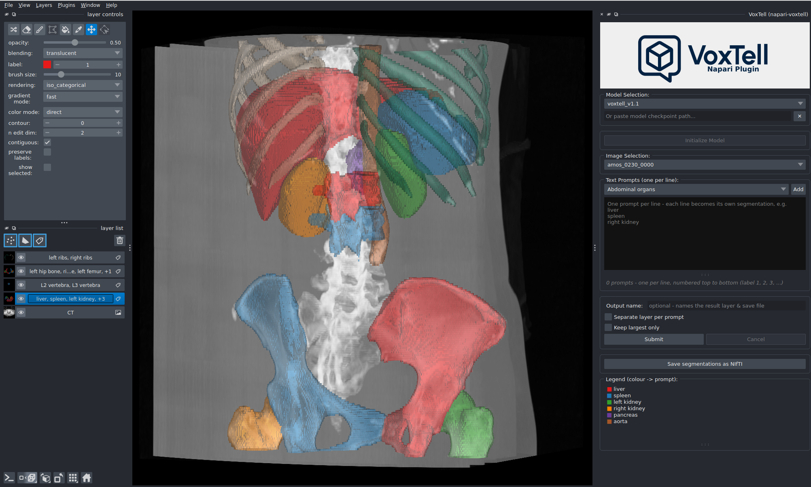

# Napari-VoxTell: A Napari Plugin For Text-Promptable 3D Medical Image Segmentation

<div align="center">

[](https://arxiv.org/abs/2511.11450)&#160;
[](https://github.com/MIC-DKFZ/VoxTell)&#160;
[](https://huggingface.co/mrokuss/VoxTell)&#160;
[](https://github.com/gomesgustavoo/voxtell-web-plugin)&#160;
[](https://github.com/CCI-Bonn/OHIF-AI)&#160;
[](https://github.com/lassoan/SlicerVoxTell)
[](https://github.com/MIC-DKFZ/napari-voxtell)&#160;

</div>


## Description

**napari-voxtell** integrates [VoxTell](https://github.com/MIC-DKFZ/VoxTell), a 3D vision-language segmentation model, into the napari ecosystem. This plugin enables text-based prompting for volumetric medical image segmentation, offering an alternative to traditional interaction methods such as bounding boxes, point clicks, or manual brush strokes, used e.g. in our [nnInteractive plugin](https://github.com/MIC-DKFZ/napari-nninteractive).

VoxTell accepts free-form text descriptions (e.g., "liver", "aortic arch", "brain tumor") to generate 3D segmentation masks. As an experimental research tool, napari-voxtell is designed to facilitate exploration and prototyping in medical image analysis workflows rather than production clinical use.

**Note:** VoxTell is an ongoing research project and may produce variable results depending on anatomical region, imaging modality, and prompt specificity. Users should validate outputs carefully and not rely on this tool for clinical decision-making without expert review.

## Features

- 🗣️ **Text-based prompting**: Segment anatomical structures and pathologies using natural language descriptions.
- 🧠 **Multi-modality support**: Compatible with CT, MRI, and PET volumetric data.
- 🔌 **Seamless napari integration**: Select image layers and visualize results directly within the napari viewer.
- ⚙️ **Flexible model loading**: Switch between model versions or load custom checkpoints for experimentation.

## Important: Image Orientation and Spacing

- ⚠️ **Image Orientation (Critical)**: For correct anatomical localization (e.g., distinguishing left from right), images **must be in RAS orientation**. VoxTell was trained on data reoriented using [this specific reader](https://github.com/MIC-DKFZ/nnUNet/blob/86606c53ef9f556d6f024a304b52a48378453641/nnunetv2/imageio/nibabel_reader_writer.py#L101). To make this robust, this plugin ships its own **VoxTell reader** that opens `.nii.gz` files through exactly that reader (see [Getting Started](#getting-started)), and it reorients results back to the image's original orientation on save. A quick way to spot a mismatch is if a simple prompt like "liver" fails and segments e.g. parts of the spleen instead.

- **Image Spacing**: The model does not resample images to a standardized spacing for faster inference. Performance may degrade on images with very uncommon voxel spacings (e.g., super high-resolution brain MRI). In such cases, consider resampling the image to a more typical clinical spacing (e.g., 1.5×1.5×1.5 mm³) before segmentation.


## Installation

### 1. Create a virtual environment

VoxTell supports Python 3.10+ and works with Conda, pip, or any other virtual environment. Here's an example using Conda:

```
conda create -n voxtell python=3.12
conda activate voxtell
```

### 2. Install PyTorch

> [!WARNING]
> **Temporary Compatibility Warning**  
> There is a known issue with **PyTorch 2.9.0** causing **OOM errors during inference** (related to 3D convolutions — see the PyTorch issue [here](https://github.com/pytorch/pytorch/issues/166122)).  
> **Until this is resolved, please use PyTorch 2.8.0 or earlier.**

Install PyTorch compatible with your CUDA version. For example, for Ubuntu with a modern Nvidia GPU:

```
pip install torch==2.8.0 torchvision==0.23.0 --index-url https://download.pytorch.org/whl/cu126
```

*For other configurations (Mac, CPU, different CUDA versions), please refer to the [PyTorch Get Started](https://pytorch.org/get-started/previous-versions/) page.*

### 3. Install napari-voxtell

During the current community **test phase**, install the latest version directly from git:

```bash
pip install "git+https://github.com/MIC-DKFZ/napari-voxtell.git"
```

> [!NOTE]
> The PyPI release (`pip install napari-voxtell`) will follow after the test phase. The plugin
> depends on `voxtell` from PyPI; the live progress bar and mid-run Cancel button additionally
> require the upcoming `voxtell` release and light up automatically once it is available — until
> then the plugin runs normally and reports results when finished.

For development, clone and install in editable mode (you can also use [uv](https://docs.astral.sh/uv/)):

```
git clone https://github.com/MIC-DKFZ/napari-voxtell.git
cd napari-voxtell
pip install -e .
```

> **Note:** Model weights are automatically downloaded from Hugging Face on first use. This may take a few minutes depending on your internet connection.

## Getting Started

You can launch the plugin in three ways.

> [!IMPORTANT]
> When opening a `.nii.gz` file, choose the **VoxTell** reader (not `napari-nifti`). The VoxTell
> reader reorients the volume to **RAS** using the same `NibabelIOWithReorient` reader the model was
> trained with, which is required for correct left/right and organ localization. Volumes opened with
> other readers may be mis-oriented and produce wrong-side / wrong-organ masks.

**Option A: Start napari and activate manually**
```
napari
```
Then go to **Plugins** > **napari-voxtell**.

**Option B: Start napari with the widget open**
```
napari -w napari-voxtell
```

**Option C: Open an image directly with the widget**
```
napari path/to/your/image.nii.gz -w napari-voxtell
```

## Usage

1. **Initialize the Model**: 
   - Open the VoxTell widget.
   - Select your model version from the dropdown (or paste a local custom model path).
   - Click **Initialize**. This downloads model weights on first use and takes some time while the model loads.
2. **Select Input**:
   - Choose the target image layer from the dropdown menu (opened with the **VoxTell** reader — see above).
3. **Prompt**:
   - Type a text description of each structure of interest (e.g., "right kidney", "lung lesion", "brainstem"), **one prompt per line**.
   - Or pick a group from the **preset** dropdown and click **Add** to append it.
4. **Choose output mode** (optional):
   - Leave **Separate layer per prompt** off for one combined multi-label layer, or turn it on for one binary layer per prompt.
   - Optionally enable **Keep largest only** and/or set an **Output name**.
5. **Segment**:
   - Click **Submit**. Results appear as new Labels layer(s); the in-widget colour legend maps each colour to its prompt.
6. **Save** (optional):
   - Use **Save segmentations as NIfTI** to merge all VoxTell layers of the selected image into one labelmap (label values follow prompt line order) in the image's original orientation, alongside a JSON legend.


<p align="center">
    
</p>

Please carefully review all segmentation outputs. Model performance varies with anatomical complexity, imaging quality, spacing, and prompt clarity. This tool is intended for research exploration, not validated clinical workflows.


## Remote inference (run the GUI on a laptop, the model on a workstation)

The plugin can run the napari GUI locally while inference runs on a remote GPU machine
(workstation or cluster). Loading, display and saving stay identical to local mode — only
the inference is offloaded over HTTP.

1. **On the GPU machine**, install the server and run it (see the VoxTell repo):
   ```bash
   pip install "voxtell[server]"
   voxtell-server --host 127.0.0.1 --port 1527
   ```
2. **From your laptop**, forward the port over SSH (the server binds to localhost by default):
   ```bash
   ssh -N -L 1527:127.0.0.1:1527 your-workstation
   ```
3. **In the widget**, set **Inference Location → Remote server**, enter `http://127.0.0.1:1527`,
   click **Connect**, then open an image and **Submit** as usual. The image is uploaded to the
   server on the first Submit; the progress bar and **Cancel** work exactly as in local mode.

For a trusted LAN you can instead bind the server to `0.0.0.0` and set an API key
(`voxtell-server --host 0.0.0.0 --api-key ...`, then paste the key into the widget).

## Citation

If you use `napari-voxtell` in your research, please cite our paper:

```bibtex
@inproceedings{rokuss2026voxtell,
      title={Voxtell: Free-text promptable universal 3d medical image segmentation},
      author={Rokuss, Maximilian and Langenberg, Moritz and Kirchhoff, Yannick and Isensee, Fabian and Hamm, Benjamin and Ulrich, Constantin and Regnery, Sebastian and Bauer, Lukas and Katsigiannopulos, Efthimios and Norajitra, Tobias and Maier-Hein, Klaus},
      booktitle={Proceedings of the IEEE/CVF Conference on Computer Vision and Pattern Recognition},
      pages={37538--37557},
      year={2026}
}
```

## License

This repository is licensed under the **Apache-2.0 License**.

**Important:** The default model checkpoints downloaded by this plugin are licensed under **Creative Commons Attribution-NonCommercial-ShareAlike 4.0 (CC-BY-NC-SA 4.0)**. Please review the [Hugging Face Model Card](https://huggingface.co/mrokuss/VoxTell) for details regarding model usage and limitations.

## Contributing

Contributions are welcome! Please feel free to submit a Pull Request or open an issue for bugs and feature requests.

## 📬 Contact

Special shoutout to [Benjamin Hamm](https://github.com/hammb) who created the first version of this plugin. For questions, issues, or collaborations, please contact:

📧 [maximilian.rokuss@dkfz-heidelberg.de](mailto:maximilian.rokuss@dkfz-heidelberg.de) / [benjamin.hamm@dkfz-heidelberg.de](mailto:benjamin.hamm@dkfz-heidelberg.de)

______________________________________________________________________

## Acknowledgments

The remote (client/server) inference mode is inspired by MIC-DKFZ's
[nnInteractive](https://github.com/MIC-DKFZ/nnInteractive) and
[napari-nninteractive](https://github.com/MIC-DKFZ/napari-nninteractive) (Apache-2.0).

<p align="left">
  
</p>
